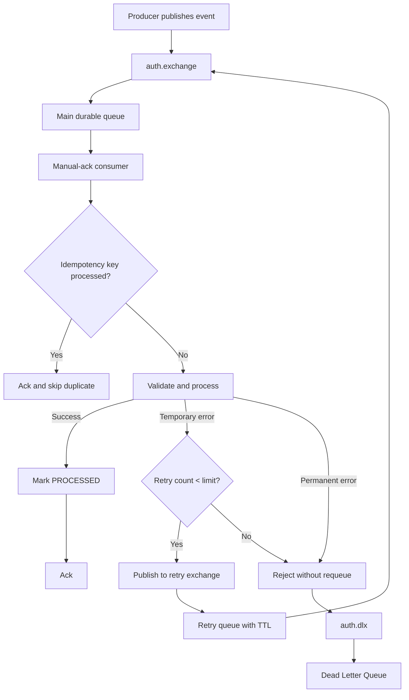

# Async Retry, DLQ, and Idempotency Flow

Key points:

- Delivery model is at-least-once.
- Duplicate processing is prevented by idempotency keys.
- Temporary failures are retried through TTL retry queues.
- Permanent failures and exhausted retries go to DLQ.

