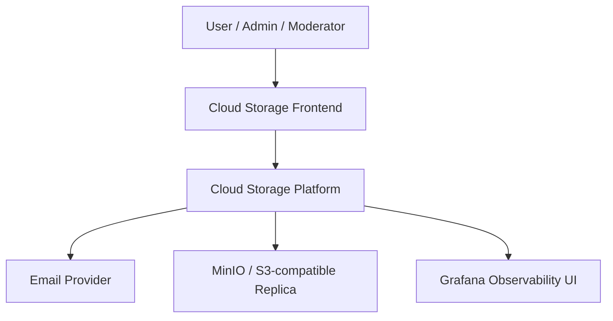
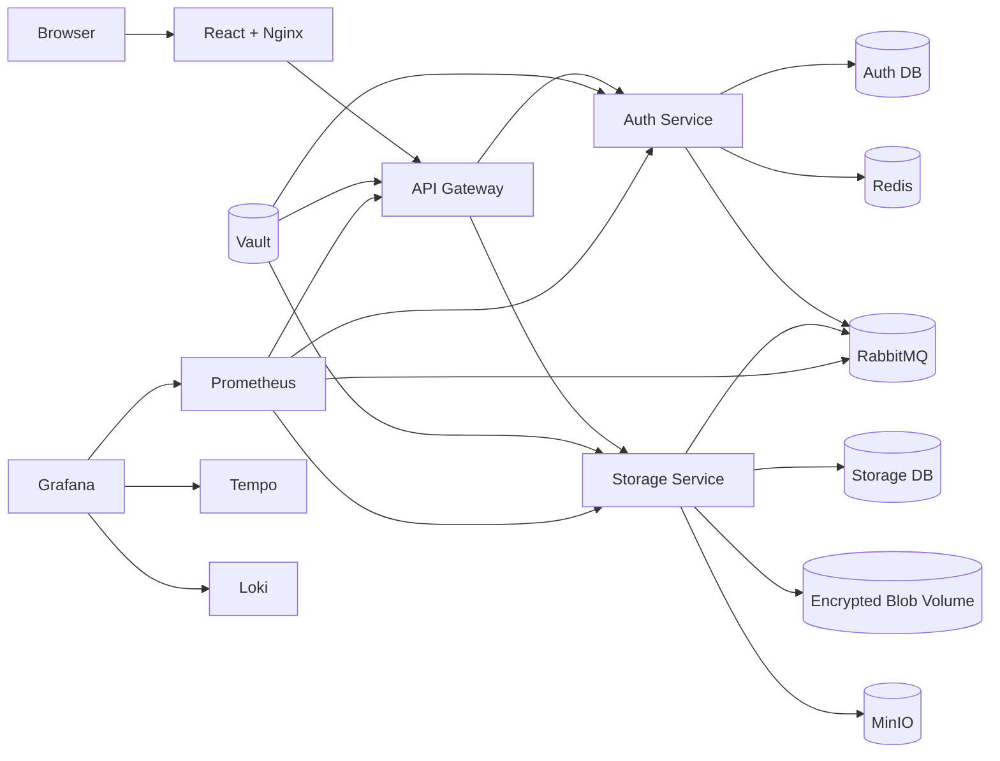

# C4 Context and Container View

## System Context

```mermaid
flowchart TB
    user[User / Admin / Moderator] --> frontend[Cloud Storage Frontend]
    frontend --> platform[Cloud Storage Platform]
    platform --> email[Email Provider]
    platform --> minio[MinIO / S3-compatible Replica]
    platform --> grafana[Grafana Observability UI]
```

## Container View

```mermaid
flowchart LR
    browser[Browser] --> frontend[React + Nginx]
    frontend --> gateway[API Gateway]
    gateway --> auth[Auth Service]
    gateway --> storage[Storage Service]
    auth --> authdb[(Auth DB)]
    auth --> redis[(Redis)]
    auth --> rabbit[(RabbitMQ)]
    storage --> storagedb[(Storage DB)]
    storage --> blobs[(Encrypted Blob Volume)]
    storage --> minio[(MinIO)]
    storage --> rabbit
    vault[(Vault)] --> gateway
    vault --> auth
    vault --> storage
    prometheus[Prometheus] --> gateway
    prometheus --> auth
    prometheus --> storage
    prometheus --> rabbit
    grafana[Grafana] --> prometheus
    grafana --> tempo[Tempo]
    grafana --> loki[Loki]
```

