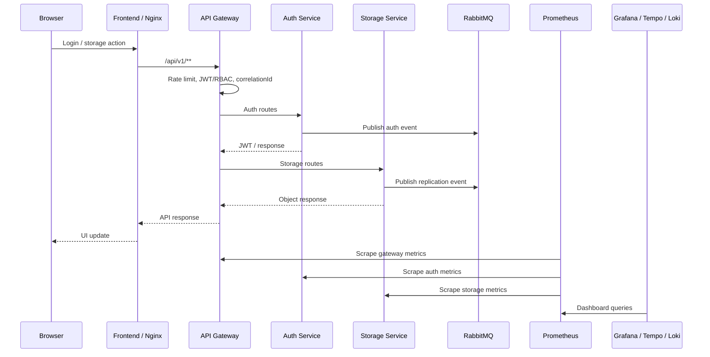

# Service Interaction Diagram

```mermaid
sequenceDiagram
    participant B as Browser
    participant F as Frontend / Nginx
    participant G as API Gateway
    participant A as Auth Service
    participant S as Storage Service
    participant Q as RabbitMQ
    participant P as Prometheus
    participant O as Grafana / Tempo / Loki

    B->>F: Login / storage action
    F->>G: /api/v1/**
    G->>G: Rate limit, JWT/RBAC, correlationId
    G->>A: Auth routes
    A->>Q: Publish auth event
    A-->>G: JWT / response
    G->>S: Storage routes
    S->>Q: Publish replication event
    S-->>G: Object response
    G-->>F: API response
    F-->>B: UI update
    P->>G: Scrape gateway metrics
    P->>A: Scrape auth metrics
    P->>S: Scrape storage metrics
    O->>P: Dashboard queries
```

