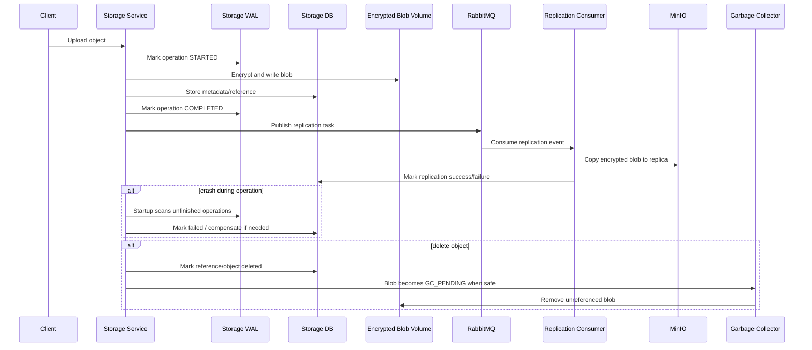

# Storage WAL, Saga, and Replication Flow

```mermaid
sequenceDiagram
    participant C as Client
    participant S as Storage Service
    participant WAL as Storage WAL
    participant DB as Storage DB
    participant Disk as Encrypted Blob Volume
    participant Q as RabbitMQ
    participant R as Replication Consumer
    participant M as MinIO
    participant GC as Garbage Collector

    C->>S: Upload object
    S->>WAL: Mark operation STARTED
    S->>Disk: Encrypt and write blob
    S->>DB: Store metadata/reference
    S->>WAL: Mark operation COMPLETED
    S->>Q: Publish replication task
    Q->>R: Consume replication event
    R->>M: Copy encrypted blob to replica
    R->>DB: Mark replication success/failure

    alt crash during operation
        S->>WAL: Startup scans unfinished operations
        S->>DB: Mark failed / compensate if needed
    end

    alt delete object
        S->>DB: Mark reference/object deleted
        S->>GC: Blob becomes GC_PENDING when safe
        GC->>Disk: Remove unreferenced blob
    end
```

