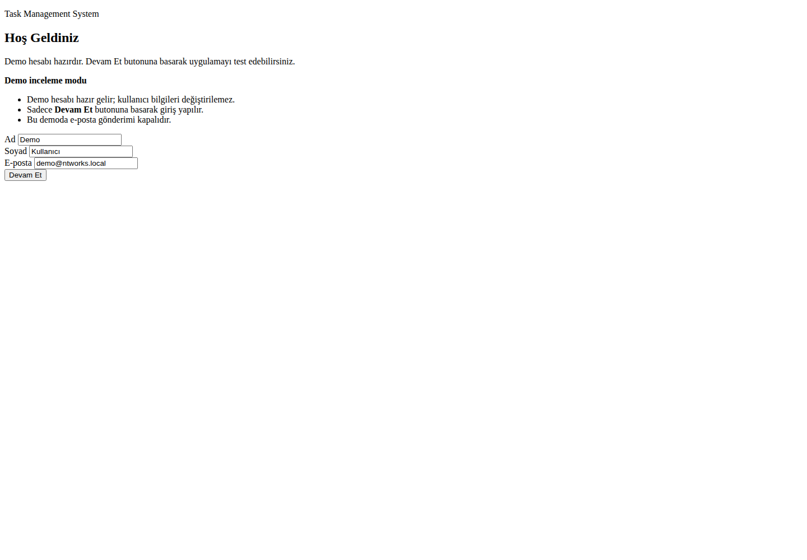

# Task Management System

Task Management System is a Spring Boot web application for creating, tracking, and reporting personal tasks. It includes a Thymeleaf interface, REST endpoints, H2 persistence, email reminder support for high-priority tasks, motivational quotes, and PDF exports.

## Features

- Create, list, search, complete, and delete tasks
- Search tasks by title and filter them by completion status
- Assign priority levels and due dates
- Send email reminders for high-priority tasks when SMTP credentials are configured
- Download task list, daily report, and weekly report PDFs
- Fetch a motivational quote from an external API
- Start with demo tasks so the UI is ready for screenshots and demos
- Keep application logs under `logs/log.txt`

## Technologies

- Java 17
- Spring Boot
- Spring Web / MVC
- Spring Data JPA
- Thymeleaf
- H2 Database
- JavaMailSender
- OpenPDF / PDFBox
- JUnit 5
- Maven

## Screenshots

### Login Page


### Task List


### New Task Form



## Sample PDFs

The repository includes PDF files generated by the application:

- [Task List PDF](docs/sample-pdfs/task-list.pdf)
- [Daily Report PDF](docs/sample-pdfs/daily-report.pdf)
- [Weekly Report PDF](docs/sample-pdfs/weekly-report.pdf)

## Setup

1. Clone the repository:

    ```bash
    git clone https://github.com/Tanerrrdogann/task-management-system.git
    cd task-management-system
    ```

2. Configure email variables if you want SMTP reminders. You can skip this step when testing the app without email delivery.

    ```bash
    export MAIL_USERNAME="your-email@gmail.com"
    export MAIL_PASSWORD="your-app-password"
    ```

   Optional variables:

    ```bash
    export MAIL_HOST="smtp.gmail.com"
    export MAIL_PORT="587"
    ```

3. Run tests:

    ```bash
    mvn test
    ```

4. Build the application:

    ```bash
    mvn clean package
    ```

5. Start the application:

    ```bash
    mvn spring-boot:run
    ```

6. Open the app:

    ```text
    http://localhost:8080
    ```

If port `8080` is already in use, run the app on another port:

```bash
mvn spring-boot:run -Dspring-boot.run.arguments=--server.port=8081
```

## Demo Data

Demo tasks are created automatically on startup when the database is empty. This keeps the task list populated for screenshots and presentations.

Disable demo data:

```bash
export DEMO_DATA_ENABLED=false
```

## API Endpoints

| Method | Endpoint | Description |
| --- | --- | --- |
| GET | `/api/tasks` | List all tasks |
| POST | `/api/tasks` | Create a task |
| GET | `/api/tasks/get/{id}` | Get one task by ID |
| PUT | `/api/tasks/{id}` | Update a task |
| DELETE | `/api/tasks/{id}` | Delete a task |
| GET | `/api/quote/motivational` | Fetch a motivational quote |
| GET | `/api/pdf/report` | Generate a task PDF report |

## Project Structure

- `src/main/java`: Application source code
- `src/main/resources/templates`: Thymeleaf pages
- `src/main/resources/static/css`: Stylesheets
- `src/test`: JUnit tests
- `documents`: User guide and test scenario documents
- `docs/screenshots`: Application screenshots
- `docs/sample-pdfs`: PDF examples generated by the app
- `postman`: Postman API collection

## Contributors

- Ismail Taner Erdogan
- Nisa Goksen
