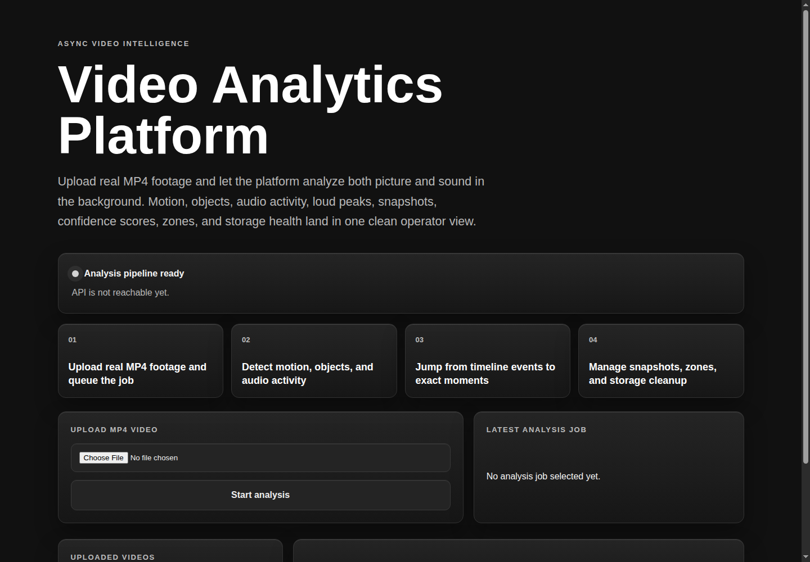
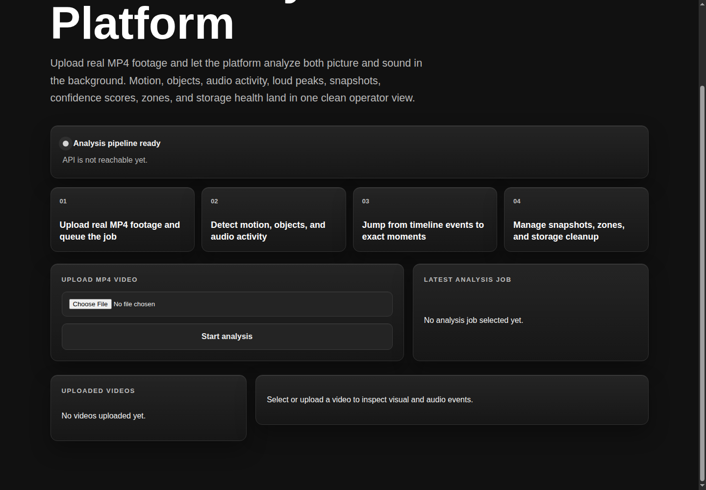

# Video Analytics Platform

An asynchronous video intelligence platform for real MP4 footage. The app uploads videos, processes them in background jobs, analyzes picture and sound, extracts speech into subtitle-style transcript segments, and presents the results in a clean operator dashboard.

The platform is built for uploaded-video analysis, not realtime webcam streaming.

## Projeyi Yapanlar

- Ismail Taner Erdogan
- Nisa Goksen

## Features

- Upload MP4 videos and queue background analysis jobs
- Review video playback, metadata, job progress, job history, and processing metrics
- Detect motion, person/object candidates, high-activity windows, and zone activity
- Analyze audio activity, silence, and loud peaks with ffmpeg
- Transcribe speech with faster-whisper and display timestamped transcript segments
- Inspect timeline events with confidence scores and snapshot previews
- Filter timeline results by event type, label, and confidence
- Browse frame-level detections through per-label tabs
- Create rectangle zones for area-based events
- Generate storage reports and run cleanup for processing artifacts

## Screenshots

### Dashboard Overview



### Video Detail


### Timeline Events


### Transcript, Zones, And Storage


### Detection List



## Architecture

- `apps/api`: FastAPI service for uploads, videos, jobs, events, detections, transcripts, zones, and storage operations
- `apps/worker`: Celery worker and scheduler for video processing, audio analysis, transcription, snapshots, and cleanup
- `apps/web`: React + Vite dashboard for upload, playback, analysis review, transcript, zones, and storage controls
- `infra/postgres/init`: PostgreSQL schema bootstrap
- `storage/uploads`: uploaded videos
- `storage/snapshots`: event snapshots
- `storage/temp`: temporary processing artifacts

## Stack

- FastAPI
- Celery
- Redis
- PostgreSQL
- OpenCV
- ffmpeg
- faster-whisper
- React + Vite
- Docker Compose

## Local Run

```bash
cp .env.example .env
docker compose up --build
```

Open:

- Web UI: `http://localhost:3010`
- API docs: `http://localhost:8010/docs`
- API health: `http://localhost:8010/health`

## Demo Flow

1. Generate a small demo MP4:

```bash
python scripts/create_demo_video.py
```

2. Start the stack:

```bash
docker compose up --build
```

3. Upload `storage/demo/demo-motion.mp4` or another MP4 in the web UI.
4. Wait for the analysis job to complete.
5. Review the video detail, timeline events, transcript, snapshots, detections, zones, and storage report.

## API Highlights

- `POST /api/videos/upload`
- `GET /api/videos`
- `GET /api/videos/{video_id}`
- `GET /api/videos/{video_id}/jobs`
- `GET /api/videos/{video_id}/events`
- `GET /api/videos/{video_id}/detections`
- `GET /api/videos/{video_id}/transcript`
- `GET /api/jobs/{job_id}`
- `GET /api/jobs/{job_id}/metrics`
- `POST /api/jobs/{job_id}/cancel`
- `POST /api/videos/{video_id}/reprocess`
- `POST /api/videos/{video_id}/zones`
- `GET /api/videos/{video_id}/zones`
- `DELETE /api/zones/{zone_id}`
- `GET /api/admin/storage/report`
- `POST /api/admin/cleanup/run`

## Configuration

Sampling profiles:

- `LOW`: 1 frame per second
- `MEDIUM`: 2 frames per second
- `HIGH`: 5 frames per second

Default profile: `MEDIUM`

Speech transcription:

```env
ENABLE_TRANSCRIPTION=true
WHISPER_MODEL_SIZE=tiny
WHISPER_DEVICE=cpu
WHISPER_COMPUTE_TYPE=int8
```

Optional YOLO/OpenCV DNN inference:

```env
YOLO_MODEL_PATH=/app/models/yolo.onnx
YOLO_LABELS_PATH=/app/models/coco.names
YOLO_CONFIDENCE_THRESHOLD=0.45
```

If no YOLO model is configured, the worker continues with OpenCV motion detection, built-in object/person fallback detection, audio analysis, speech transcription, snapshots, and metrics.

## Event Types

- `MOTION_STARTED`
- `MOTION_ENDED`
- `PERSON_DETECTED`
- `OBJECT_DETECTED`
- `ZONE_ENTERED`
- `ZONE_EXITED`
- `HIGH_ACTIVITY_WINDOW`
- `AUDIO_ACTIVITY_STARTED`
- `AUDIO_ACTIVITY_ENDED`
- `LOUD_AUDIO_PEAK`
- `AUDIO_SILENCE_DETECTED`
- `SPEECH_TRANSCRIBED`

## Storage Management

The platform includes scheduled and manual cleanup flows for temporary artifacts and snapshots. The dashboard can refresh storage usage, run cleanup, and keep uploaded videos, snapshots, temp files, and total artifact usage visible from the same operator view.

## Scope

- Uploaded MP4 analysis
- Background processing
- Visual detection
- Audio activity analysis
- Speech-to-text transcript extraction
- Timeline review
- Snapshot review
- Zone and storage management
