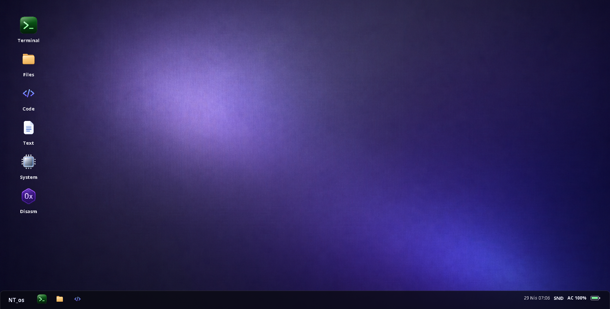
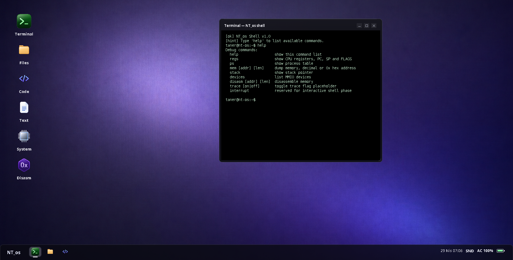
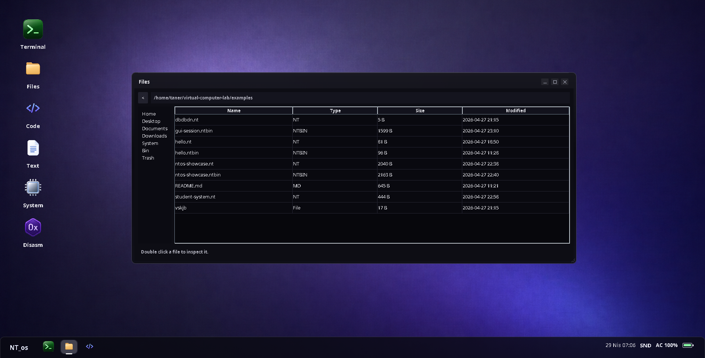
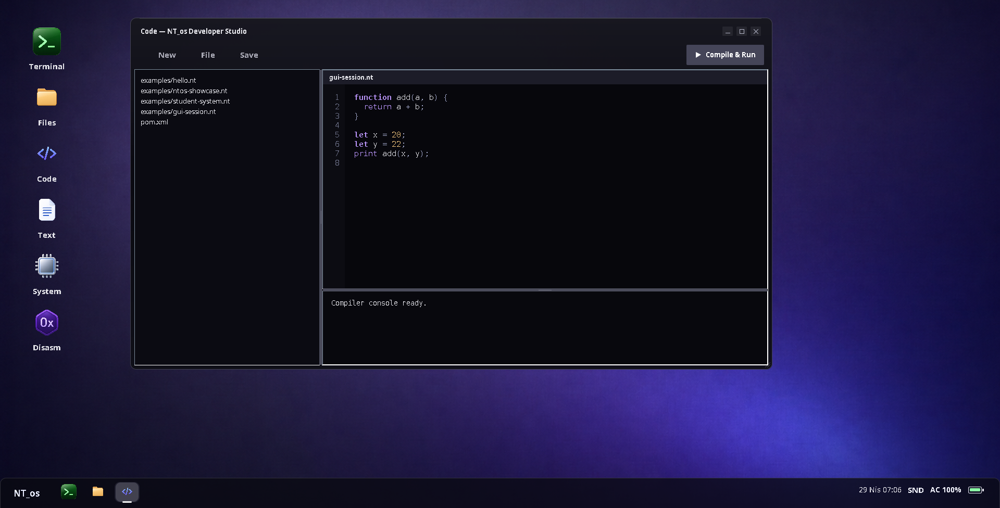
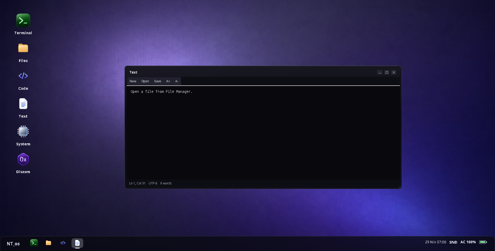
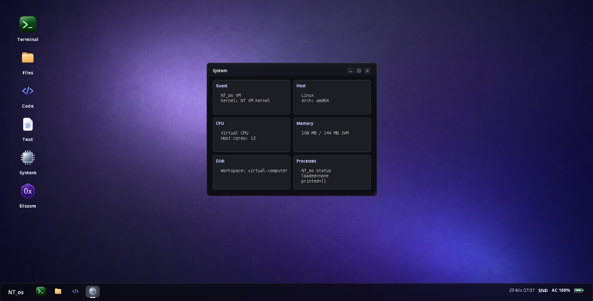
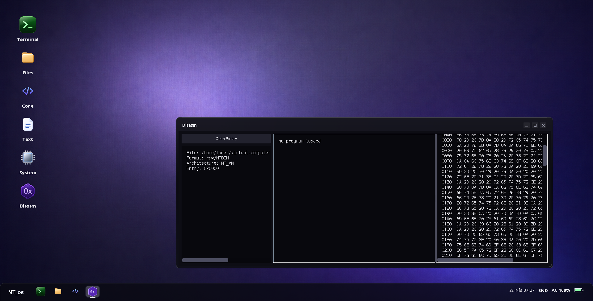

# Virtual Computer Lab

An educational virtual computer and operating system simulator for visualizing bytecode loading, byte-addressable memory, CPU execution, process scheduling, system calls, interrupts, and memory-mapped I/O.

## Overview

`NT_os` includes a custom `.ntbin` executable format, byte-addressable virtual memory, a loader, a fetch-decode-execute CPU, a small source language compiler, process control blocks, scheduling, syscalls, heap allocation, timer ticks, memory-mapped I/O devices, a disassembler, a debug shell, and a desktop UI for trying the VM without memorizing commands.

## Screenshots

Project screenshots are kept in [`docs/screenshots`](docs/screenshots).

| Desktop | Terminal |
| --- | --- |
|  |  |

| Files | Code Studio |
| --- | --- |
|  |  |

| Text Editor | System Monitor |
| --- | --- |
|  |  |

| Disassembler |
| --- |
|  |

## Architecture

- OS name: `NT_os`
- Executable format: `.ntbin`
- Source format: `.nt`
- Magic number: `NTBN`
- CPU: R0-R7, PC, SP, IR, FLAGS
- OS: PCB table, Round Robin scheduler, syscalls, process heap pointers
- Devices: `NT_TTY`, `NT_KEYBOARD`, `NT_TIMER`, `NT_LED`
- Virtual memory size: `65536` bytes
- Memory layout:

```text
0x0000 - 0x1FFF  OS reserved
0x2000 - 0x7FFF  user code/data
0x8000 - 0xBFFF  heap
0xC000 - 0xFEFF  stack
0xFF00 - 0xFFFF  MMIO
```

## Executable Format

The binary file starts with a 20-byte header:

```text
4 bytes   magic number: NTBN
2 bytes   version
2 bytes   reserved
4 bytes   entry point
4 bytes   code size
4 bytes   data size
```

After the header, the file stores:

```text
code section
data section
```

## Run It

Run the tests:

```bash
mvn test
```

Run the demo loader:

```bash
mvn exec:java
```

On a machine with a desktop display, that command opens the NT_os desktop UI.

The desktop includes:

- NT_os desktop workspace
- Terminal icon/window
- File Manager icon/window
- Code Editor with a Compile + Run button and its own compiler output panel
- Text Viewer for `.txt`, `.md`, `.nt`, `.ntbin`, and other inspectable files
- System Monitor
- Disassembler
- device/process/register visibility
- closeable app windows
- minimize/maximize/close window controls
- bottom dock/taskbar with pinned apps and open windows
- protected terminal prompt: `taner@nt-os:~$`

The terminal behaves like a real prompt: the prompt prefix is printed automatically, protected from deletion, and command entry stays on the active input line.

Run the terminal demo explicitly:

```bash
mvn exec:java -Dexec.args=--cli
```

The CLI command creates `examples/hello.nt`, compiles it to `examples/hello.ntbin`, boots the `NT_os` loader, loads the binary into virtual memory at `0x2000`, executes it on the virtual CPU, and prints register state.

Run with your own source file:

```bash
mvn exec:java -Dexec.args="examples/hello.nt"
```

Run with your own compiled `.ntbin` file:

```bash
mvn exec:java -Dexec.args="examples/hello.ntbin"
```

Force the GUI:

```bash
mvn exec:java -Dexec.args=--gui
```

The demo program compiles this language shape:

```text
function add(a, b) {
  return a + b;
}

let x = 20;
let y = 22;
print add(x, y);
```

It prints `42` through software interrupt `INT 1`, then leaves `42` in `R0`.

## Syscalls

Programs invoke OS services through `INT syscallNumber`:

```text
1 print
2 exit
3 sleep
4 alloc
5 getpid
6 yield
```

## Debug Tools

The debug shell supports:

```text
regs
mem 0x2000 64
stack
ps
disasm 0x2000 64
trace on
devices
interrupt
```
